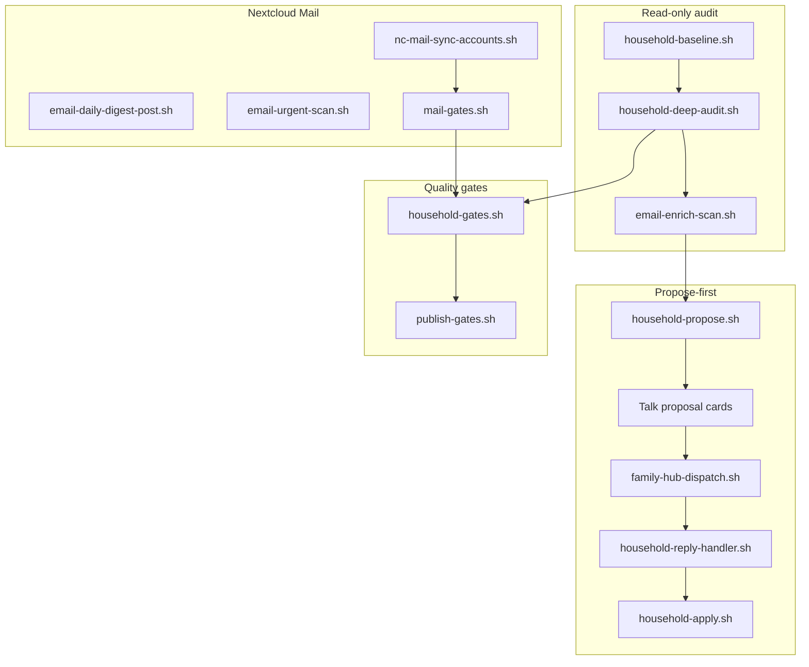

# openclaw-skylight

[](LICENSE)
[](https://github.com/openclaw/openclaw)
[](CHANGELOG.md)

**OpenClaw skills + shell automation for Skylight Calendar frames** — household audit, propose-first Family Hub approvals, morning digests, and optional Nextcloud Mail enrichment.

> **Unofficial Skylight API.** Skylight may change without notice. This project is **propose-first by design**: OpenClaw never silently writes to family calendars or chores from chat.

---

## Table of contents

- [What this project is](#what-this-project-is)
- [Design principles](#design-principles)
- [Architecture](#architecture)
- [Prerequisites](#prerequisites)
- [Quick start](#quick-start)
- [Configuration](#configuration)
- [Nextcloud Mail (3 accounts)](#nextcloud-mail-3-accounts)
- [OpenClaw integration](#openclaw-integration)
- [Automation ladder](#automation-ladder)
- [Week-2 capacity (Talk lane relief)](#week-2-capacity-talk-lane-relief)
- [Gate matrix (QA)](#gate-matrix-qa)
- [Repository layout](#repository-layout)
- [Development workflow](#development-workflow)
- [Cron templates](#cron-templates)
- [Troubleshooting](#troubleshooting)
- [Related projects](#related-projects)
- [License](#license)

---

## What this project is

`openclaw-skylight` is a **publishable integration layer** between [OpenClaw](https://github.com/openclaw/openclaw) agents and a household **Skylight frame**. It ships:

| Bundle | Purpose |
|--------|---------|
| **Skills** | `skylight`, `email-intelligence`, `flight-triage` — agent instructions |
| **Scripts** | Auth, audit, propose/apply, Talk posts, mail sync, gate aggregators, **shell-direct cron** |
| **Config** | JSON Schema for `household-model.json`, mail account templates, cron job stubs, **cron-shell-direct.yaml** |
| **Docs** | Setup, API quirks, full pass/fail gate matrix, **week-2 capacity guide** |

It does **not** include NC-GCS fleet ops, HPB patches, MySubaru vehicle automation, or private operator runbooks. Vehicle integration lives in **openclaw-subaru**; fleet ops in separate repos or local `~/.openclaw/`.

---

## Design principles

These rules are intentional — follow them when extending the project:

1. **Propose first, apply second** — every calendar/chore change goes through a proposal card in Family Hub; operators reply `@openclaw YES|NO|EDIT <id>`.
2. **Dispatch before LLM tools** — when a Talk message matches a proposal reply, exec `skylight-family-hub-dispatch.sh` first (deterministic routing).
3. **No secrets in git** — credentials in `~/.openclaw/.env` and `~/.openclaw/.env.d/*.secret` only; run `scrub-for-publish.sh` before every push.
4. **Gates before release** — `mail-gates.sh`, `skylight-household-gates.sh`, and `publish-gates.sh` must report `hard_fail=0` on homelab before tagging.
5. **Family mail is read-only enrich** — ops/work accounts handle digest and urgent scan; family Gmail feeds calendar location hints only.
6. **Hide, never delete** — stale `ask_operator` cards defer after 7 days; no auto-delete or rename of Skylight resources.

---

## Architecture



**Talk rooms (operator-configured):**

| Room env | Typical use |
|----------|-------------|
| `SKYLIGHT_FAMILY_TALK_ROOM` | Proposal cards, morning digest, `@openclaw` household chat |
| `SKYLIGHT_OPS_TALK_ROOM` / `EMAIL_DIGEST_*_ROOM` | Fleet briefs, ops/work email digest |

---

## Prerequisites

| Requirement | Notes |
|-------------|-------|
| [OpenClaw](https://github.com/openclaw/openclaw) **2026.4+** | Gateway + skills; `tools.profile: full` recommended for OpenClaw stacks |
| [skylight-tools](https://github.com/aarons22/skylight-tools) | CLI at `~/go/bin/skylight` — chores, lists, categories |
| Python 3.10+ | Embedded in most scripts |
| Optional: Nextcloud | Talk (proposal cards) + Mail app (Gmail IMAP/SMTP) |
| Optional: Docker | `occ mail:account:sync` runs against `cloud_app` container |

---

## Quick start

```bash
git clone git@github.com:vdroners/openclaw-skylight.git
cd openclaw-skylight

# 1. Operator secrets (never commit)
cp .env.example ~/.openclaw/.env    # or copy to repo .env for local dev
cp config/household-model.example.json ~/.openclaw/config/household-model.json
# Edit: frame ID, calendar emails, calendar_source_ids, kid category IDs

# 2. Skylight auth
bash scripts/skylight-login.sh
bash scripts/skylight-smoke.sh

# 3. Install into OpenClaw home
bash scripts/install-to-openclaw.sh
# Re-run with --force to replace local script copies with symlinks

# 4. Structure check (no live Skylight writes)
bash scripts/skylight-household-gates.sh --skip-live

# 5. Full gate run (after mail + audit data exist)
bash scripts/skylight-household-gates.sh
```

Enable skills in OpenClaw: **`skylight`**, **`email-intelligence`**.

Detailed steps: [docs/SETUP.md](docs/SETUP.md).

---

## Configuration

### Environment (`.env`)

Copy [.env.example](.env.example). Required groups:

| Group | Variables |
|-------|-----------|
| Skylight | `SKYLIGHT_EMAIL`, `SKYLIGHT_PASSWORD`, `SKYLIGHT_FRAME_ID`, `SKYLIGHT_*_CALENDAR_ID`, `SKYLIGHT_FAMILY_TALK_ROOM` |
| Nextcloud | `NEXTCLOUD_URL`, `NEXTCLOUD_USER`, `NEXTCLOUD_PASS` |
| Mail routing | `FAMILY_*`, `OPS_*`, `WORK_*`, `URGENT_SCAN_ACCOUNTS=ops,work` |

Loaders: `scripts/load-skylight-env.sh`, `scripts/load-nextcloud-env.sh`.

### Household model

`config/household-model.json` drives audit logic (writable calendars, chore defaults, email keywords). Validate:

```bash
bash scripts/validate-household-model.sh config/household-model.json
```

Key fields: `writable_calendar_emails`, `calendar_source_ids` (for W-1b gate), `chore_time_defaults`, `kid_categories`. See [docs/HOUSEHOLD-MODEL.md](docs/HOUSEHOLD-MODEL.md).

---

## Nextcloud Mail (3 accounts)

OpenClaw supports **three Gmail-backed NC Mail accounts**:

| Role | IMAP | SMTP | Used by |
|------|------|------|---------|
| **family** | yes | no | `skylight-email-enrich-scan.sh` (E2) |
| **ops** | yes | yes | daily digest, urgent scan |
| **work** | yes | yes | daily digest, urgent scan |

**Setup:**

```bash
# App passwords → ~/.openclaw/.env.d/*.secret (chmod 600)
cp config/mail-accounts.example.json ~/.openclaw/config/mail-accounts.json

bash scripts/validate-mail-secrets.sh
bash scripts/nc-mail-sync-accounts.sh --check
bash scripts/nc-mail-sync-accounts.sh --apply   # creates missing + occ sync
bash scripts/mail-gates.sh --check
```

Merge printed `*_MAIL_ACCOUNT_ID` lines into `.env`. Full guide: [docs/NEXTCLOUD-MAIL.md](docs/NEXTCLOUD-MAIL.md).

Backward compat: `scripts/nc-mail-add-gmail.sh` wraps sync for family only.

---

## OpenClaw integration

### Skills

| Skill | When the OpenClaw agent uses it |
|-------|---------------------|
| [`skylight`](skills/skylight/SKILL.md) | Family calendar, chores, grocery, rewards, recipes |
| [`email-intelligence`](skills/email-intelligence/SKILL.md) | Inbox triage, digest, draft replies (ops/work); CSRF header required |

**Critical:** All Mail API calls need `OCS-APIREQUEST: true` (documented in email-intelligence skill).

### Family Hub dispatch (mandatory)

Before any LLM tool on proposal replies:

```bash
bash ~/.openclaw/scripts/skylight-family-hub-dispatch.sh "@openclaw NO enrich-chore-001"
```

Supports `--dry-run` for automated gate **C1b** (no batch write, no Talk post).

### Verify OpenClaw stack

After install:

```bash
bash ~/.openclaw/scripts/verify-openclaw-capabilities.sh
```

Includes `mail-gates.sh --check` when scripts are symlinked.

---

## Automation ladder

| Tier | Behavior | Status |
|------|----------|--------|
| **0** | 100% propose-first; operator YES in Family Hub | **Active** |
| **1** | Auto-apply email location when confidence ≥ 0.9 | Future |
| **2** | Auto-apply chore time defaults | Future |

Workflow:

```bash
bash scripts/skylight-household-baseline.sh          # B0 once
bash scripts/skylight-household-deep-audit.sh        # A1–A3
bash scripts/skylight-email-enrich-scan.sh           # E2 family only
bash scripts/skylight-household-propose.sh --limit 12
bash scripts/skylight-household-propose.sh --email-only --limit 4
```

Operator guide: [docs/HOUSEHOLD-ENRICHMENT.md](docs/HOUSEHOLD-ENRICHMENT.md).

---

## Week-2 capacity (Talk lane relief)

**v0.2.2** addresses OpenClaw gateway starvation when fleet `agentTurn` cron runs every 10–20 minutes alongside Talk.

| Component | Purpose |
|-----------|---------|
| **Shell-direct cron** | systemd timers + `run-openclaw-cron-shell.sh` — no LLM for hot paths |
| **Test-week profile** | Reversibly disable ~21 heavy agentTurn jobs (`apply-test-week-cron-profile.sh`) |
| **G-DAY gates** | `openclaw-day-review.sh` — PERF/CAP/SESS/NC metrics since profile baseline |
| **Email auto gate** | `EMAIL_TO_EVENT_AUTO=0` until Family Hub S0 sign-off |

```bash
bash scripts/install-to-openclaw.sh --force
bash ~/.openclaw/scripts/apply-test-week-cron-profile.sh
OPENCLAW_SKYLIGHT_ROOT="$(pwd)" python3 scripts/install-openclaw-shell-cron.sh
make ai-gates day-review
```

Restore: `bash ~/.openclaw/scripts/restore-cron-profile.sh`

Full guide: [docs/WEEK2-CAPACITY.md](docs/WEEK2-CAPACITY.md). Manual UI gates: [docs/OPERATOR-MANUAL-GATES.md](docs/OPERATOR-MANUAL-GATES.md).

---

## Gate matrix (QA)

| Aggregator | Command | When |
|------------|---------|------|
| Talk | `bash scripts/talk-response-audit.sh --check --phase all` | After Talk policy changes |
| Mail | `bash scripts/mail-gates.sh --check` | After mail sync |
| Household | `bash scripts/skylight-household-gates.sh` | Before sign-off |
| OpenClaw AI | `bash scripts/openclaw-ai-gates.sh --check` | Cron + dispatch + TR-ALL + **G-DAY** |
| Day review | `bash ~/.openclaw/scripts/openclaw-day-review.sh --check` | Daily during test week |
| Publish | `bash scripts/publish-gates.sh` | Before git push |
| Makefile | `make gates` | All of the above (except capabilities) |
| Makefile | `make day-review` | G-DAY only |

**Success criteria:** `mail-gates` and `skylight-household-gates` both report **`hard_fail=0`**.

Full matrix: [docs/GATES.md](docs/GATES.md).

Manual gates (operator): **C1**, **C2**, **C1b-LIVE**, **DIS-5**, **S0**, **T3–T7** — [docs/OPERATOR-MANUAL-GATES.md](docs/OPERATOR-MANUAL-GATES.md).

---

## Repository layout

```
openclaw-skylight/
├── README.md, CHANGELOG.md, LICENSE, SECURITY.md, CONTRIBUTING.md
├── .env.example
├── config/
│   ├── household-model.example.json   # + JSON Schema
│   ├── mail-accounts.example.json
│   ├── references/cron-shell-direct.yaml, test-week-cron-profile.yaml
│   └── cron/*.job.json.template
├── scripts/
│   ├── load-skylight-env.sh, load-nextcloud-env.sh
│   ├── skylight-*.sh, skylight_*.py       # audit, propose, chores, recipes
│   ├── talk-response-audit.sh, talk-post.sh
│   ├── openclaw-ai-gates.sh, openclaw-catchup.sh, openclaw-day-review.sh
│   ├── run-openclaw-cron-shell.sh, install-openclaw-shell-cron.sh
│   ├── flight-event-monitor.sh, email-to-event-shell.sh, backup-verify-shell.sh
│   ├── apply-test-week-cron-profile.sh, restore-cron-profile.sh, cron-audit.sh
│   ├── household-proposal-nudge.sh, flight-triage-*.sh
│   ├── nc-mail-sync-accounts.sh, mail-gates.sh
│   ├── install-to-openclaw.sh, Makefile
│   ├── publish-gates.sh, scrub-for-publish.sh
│   └── validate-*.sh
├── skills/skylight/, skills/email-intelligence/, skills/flight-triage/
└── docs/                              # SETUP, GATES, OPENCLAW-STACK, WEEK2-CAPACITY, plans/
```

Install symlinks repo scripts → `~/.openclaw/scripts/` and skills → `~/.openclaw/workspace/skills/`.

---

## Development workflow

1. Edit scripts/skills/docs in this repo (or via symlinks after `install-to-openclaw.sh`).
2. Run homelab gates: `skylight-household-gates.sh`, `mail-gates.sh --check`.
3. Before push:

```bash
bash scripts/publish-gates.sh
bash scripts/scrub-for-publish.sh
```

4. Update [CHANGELOG.md](CHANGELOG.md) under `[Unreleased]`.
5. Tag releases (`v0.1.x`) only on scrubbed commits.

Contributor guide: [CONTRIBUTING.md](CONTRIBUTING.md).

### Code conventions (OpenClaw projects)

- **`set -euo pipefail`** on all bash entrypoints.
- **No hardcoded** room tokens, frame IDs, or real emails in committed files — use env + `household-model.json`.
- **Dry-run flags** for gates that must not mutate state (`--dry-run` on propose, dispatch, defer-stale, digest).
- **Skills** document exec-only HTTP (Mail CSRF header, Skylight Bearer from login script).
- **Secrets** only in `~/.openclaw/.env.d/*.secret` (mode 600); never in logs or state JSON committed to git.

---

## Cron templates

Templates in `config/cron/` (no secrets — env placeholders only):

| Template | Purpose |
|----------|---------|
| `skylight-family-morning.job.json.template` | Daily Family Hub digest |
| `skylight-audit-weekly.job.json.template` | Weekly regression audit |
| `skylight-defer-stale.job.json.template` | Defer unanswered ask cards |

Import into OpenClaw cron after filling room tokens and schedule in your local copy.

---

## Troubleshooting

| Symptom | Fix |
|---------|-----|
| Ops Talk slow / lane wait | Week-2 profile + shell-direct — [docs/WEEK2-CAPACITY.md](docs/WEEK2-CAPACITY.md) |
| False flight alerts | Configure `OPENCLAW_GATEWAY_HEALTH_URL`; mavlink optional |
| `401` on Skylight API | `bash scripts/skylight-auth-refresh.sh` |
| W-1 calendar probe fail | Set `SKYLIGHT_*_CALENDAR_ID` or `calendar_source_ids` in household model |
| E2 timeout | Pin `FAMILY_MAIL_ACCOUNT_ID`; ensure inbox cached (`occ mail:account:sync`) |
| Mail API CSRF error | Add `OCS-APIREQUEST: true` header |
| scrub / publish fail | Remove PII; see [SECURITY.md](SECURITY.md) |

More: [docs/TROUBLESHOOTING.md](docs/TROUBLESHOOTING.md), [docs/API-QUIRKS.md](docs/API-QUIRKS.md).

---

## Related projects

- **[NC-GCS](https://github.com/vdroners/NC-GCS)** — fleet ground control (separate repo; not bundled here)
- **openclaw-subaru** — private sibling repo for MySubaru / vehicle automation (install alongside this project into `~/.openclaw`)
- **email-to-event** — shell scan wrapper shipped; auto-create gated by `EMAIL_TO_EVENT_AUTO`

---

## License

MIT — see [LICENSE](LICENSE).
