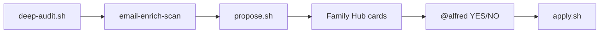

# openclaw-skylight

OpenClaw agent integration for **Skylight Calendar** frames: morning digest, household audit, propose-first Family Hub approvals, and optional Nextcloud Mail enrichment.

> Unofficial Skylight API — use at your own risk. **Propose-first by design** — no silent calendar/chore writes from chat.

## What it does



- **Read-only audit** of calendars + chores → enrichment proposals
- **Family Hub cards** — operators approve with `@alfred YES enrich-chore-001`
- **Email hints** — match Gmail subjects to calendar locations (read-only)
- **Morning digest** — calendar, chores, points, grocery via Talk

## Prerequisites

- [OpenClaw](https://github.com/openclaw/openclaw) 2026.4+
- [skylight-tools](https://github.com/aarons22/skylight-tools) CLI (`~/go/bin/skylight`)
- Optional: Nextcloud with Talk + Mail apps

## Quick start

```bash
git clone git@github.com:vdroners/openclaw-skylight.git
cd openclaw-skylight
cp .env.example .env   # fill SKYLIGHT_* and NEXTCLOUD_*
cp config/household-model.example.json config/household-model.json  # edit for your frame

bash scripts/skylight-login.sh
bash scripts/install-to-openclaw.sh
bash scripts/skylight-smoke.sh
bash scripts/skylight-household-gates.sh --skip-live   # structure check first
```

Enable skills `skylight` and `email-intelligence` in OpenClaw.

## Architecture

| Layer | Scripts |
|-------|---------|
| Auth | `skylight-login.sh`, `load-skylight-env.sh` |
| Audit | `skylight-household-deep-audit.sh`, `skylight-household-baseline.sh` |
| Proposals | `skylight-household-propose.sh`, `skylight-family-hub-dispatch.sh` |
| Apply | `skylight-household-apply.sh`, `skylight-household-rollback.sh` |
| QA | `skylight-household-gates.sh`, `publish-gates.sh` |

See [docs/GATES.md](docs/GATES.md) for the full pass/fail matrix.

## Related projects

- [NC-GCS](https://github.com/vdroners/NC-GCS) — separate fleet GCS stack (not included here)
- `email-to-event` skill — future module; not shipped in v0.1.0

## License

MIT — see [LICENSE](LICENSE).
